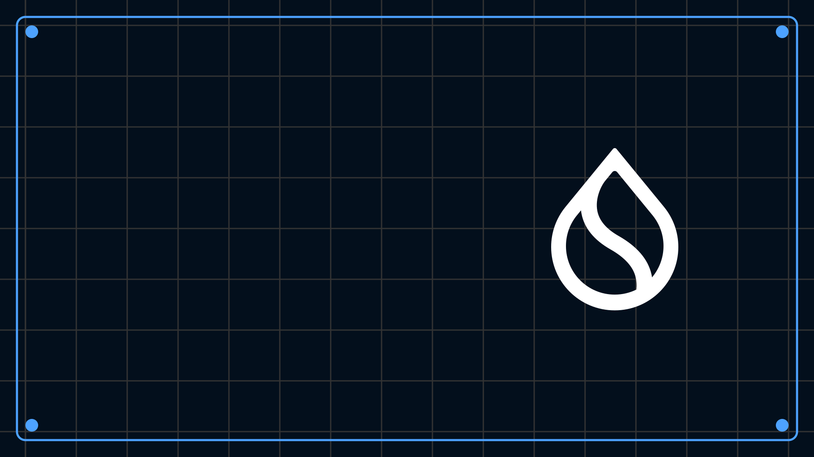

# Sui 101
## Sui入門

<p class="subtitle">対象: 学生・Web2開発者・クリプトに興味がある人</p>

---

## 学習目標
- Suiとブロックチェーンの基本を理解する  
- ネットワークとやり取りするためにSlushを準備する  
- SuiブロックチェーンでNFTを発行する  

---

## Agenda
- ブロックチェーンとは何か、Suiの仕組み  
- Suiのオブジェクト中心モデルの特徴  
- 基本的なウォレット設定、Move、トランザクション  

---

## Resources
- [docs.sui.io](http://docs.sui.io)
- [Slush](https://slush.app/)
- [Sui Developer Forum](https://forums.sui.io/)
- [Sui Move Intro Course](https://github.com/sui-foundation/sui-move-intro-course)


---

## Suiとは?
- 高速処理と高いスケーラビリティを実現するレイヤー1ブロックチェーン  
- 資産とオブジェクトを中心にしたアーキテクチャ  
- Move言語を用いたスマートコントラクト開発が可能  

---

## Suiの特徴とは？
### オブジェクト中心モデル
- Suiブロックチェーン上の資産は「オブジェクト」  
- 各オブジェクトは固有のIDを持ち、データを保存・変更可能  
- アカウントベースのブロックチェーンとは異なる  

---

## ブロックチェーンとは？
- 分散型台帳（Distributed Ledger Technology）を用いる  
- 改ざんできない透明な取引記録を実現  
- ネットワーク上の多数のコンピュータに取引履歴を分散保存  

---

## Move言語の紹介
Move言語は、安全性と柔軟性を備えたスマートコントラクトのプログラミング言語です。  

Docs:  
- https://docs.sui.io/concepts/sui-move-concepts

---

## SuiにおけるNFTとFTの比較
### NFT (Non-Fungible Token)
- 固有のIDを持つオンチェーン上のユニークなオブジェクト  
- 名前、説明、画像など豊富なメタデータを保持可能  
- 各NFTは独立したオブジェクトとして存在  

### FT (Fungible Token)
- お金のように同じ価値を持つ単位  
- Suiでは「Coin型」で表現される  
- 分割したりまとめたりできる  

---

## Move言語によるNFTの実装例
```move
module workshop::nft;

use std::string;
use sui::url;

public struct MyNFT has key, store {
    id: UID,
    name: string::String,
    url: url::Url,
}

public entry fun mint(name: vector<u8>, url_bytes: vector<u8>, ctx: &mut TxContext) {
    let nft = MyNFT {
        id: object::new(ctx),
        name: name.to_string(),
        url: url::new_unsafe_from_bytes(url_bytes),
    };
    transfer::public_transfer(nft, ctx.sender());
}
```
---

## Move言語によるFTの実装例

```move
module examples::my_coin_new;

use sui::coin_registry;

// コインの型識別子。コインは次のような型タグを持ちます:
// `Coin<package_object::mycoin::MYCOIN>`
// 型の名前がモジュール名と一致することを確認してください。
public struct MY_COIN_NEW has drop {}

// モジュール初期化関数はモジュール公開時に一度だけ呼び出されます。`TreasuryCap`が
// 公開者に送信され、公開者がミントと焼却を制御します。`MetadataCap`も公開者に送信されます。
fun init(witness: MY_COIN_NEW, ctx: &mut TxContext) {
    let (builder, treasury_cap) = coin_registry::new_currency_with_otw(
        witness,
        6, // 小数点以下の桁数
        b"MY_COIN".to_string(), // シンボル
        b"My Coin".to_string(), // コイン名
        b"Standard Unregulated Coin".to_string(), // 説明
        b"https://example.com/my_coin.png".to_string(), // アイコンURL
        ctx,
    );

    let metadata_cap = builder.finalize(ctx);

    // このオブジェクトをフリーズすると、タイトル、名前、アイコン画像を含むメタデータが不変になります。
    // 可変性を許可したい場合は、代わりにpublic_share_objectで共有してください。
    transfer::public_transfer(treasury_cap, ctx.sender());
    transfer::public_transfer(metadata_cap, ctx.sender());
}
```
---

## Slush Walletを設定
- Slushをインストール: https://slush.app/  
- Seed Phraseをバックアップする  
- テストネットSUIを請求する  

---

## Slushでテストネットに接続する
1. 画面右下のユーザーアカウントボタンを押す
2. `Settings`の`Network`をタップ
3. `Testnet`を選択する  

---

## SUIをFaucetサイトから手に入れる
1. Suiのテストネットfaucetサイトにアクセス：https://faucet.sui.io/  
2. アドレスをペーストする  
3. テストネットSUIをリクエスト  

---

## ウォレットの操作画面を探検する
1. SUIのトークンバランスを確認  
2. ミントしたNFTを確認  

---

## 基本的なトランザクション
### NFTのミント / トークンを送る
- サンプルサイト（TestnetでNFTをMINT）: https://nft-mint-sample.vercel.app/  
- 他のウォレットにトークンを送ってみよう  

---

## Suiでのガス代について
1. すべてのトランザクションにはガス代としてSUIが必要  
2. ガス代の用途：  
   a. 計算処理  
   b. オブジェクトの保存  
3. テストネット用SUIは無料だが上限あり  
4. デプロイ前に必ず残高を確認すること  

Docs:  
- https://docs.sui.io/concepts/tokenomics/gas-in-sui

---

## Sui CLIとは?
Sui CLIは、Suiネットワークとやり取りするためのコマンドラインツールです。  

Docs: https://docs.sui.io/references/cli/client

---

## Sui CLIのインストール
- macOS: `brew install sui`  
- Windows: `choco install sui`  
- Linux: `brew install sui`  

※本講義ではdevcontainerを用いるのでインストールは必須ではありません。

---

## 設定の確認・テストネットへの切り替え
```bash
# バージョン確認（インストール確認）
sui --version

# Testnet環境に切り替え
sui client switch --env testnet
```

---

## Sui CLIでアドレスのインポート
```bash
# Slushで作ったアドレスをインポート
sui keytool import INPUT KEY_SCHEME

# インポートしたアドレスが有効か確認
sui client active-address
```
Docs: https://docs.sui.io/references/cli/cheatsheet

---

## Sui CLIでウォレットの中身を確認
```bash
# アクティブアドレスにガス代があるか確認
sui client gas
```
Docs: https://docs.sui.io/references/cli/cheatsheet

---

## Packageとは？
- 1つ以上のモジュールをまとめた単位  
- Suiブロックチェーン上でデプロイ・管理される  
- バージョン管理が可能  
- 例：NFTマーケット用の一連のモジュールを含むパッケージ  

---

## Moduleとは？
- Move言語で書かれたコードの再利用可能な単位  
- 関数や構造体などの定義をまとめたもの  
- スマートコントラクトのロジックを実装する場所  
- 例：NFTをミントする関数、コインを転送する関数など  

---

## Moduleを確認する方法
1. Sui Explorer（例：Suiscan Testnet）: https://suiscan.xyz/testnet/home  
2. Move moduleを検索する  
   - サンプル: `0x9f992cc2430a1f442ca7a5ca7638169f5d5c00e0ebc3977a65e9ac6e497fe5ef`

---

## Mini Quiz / Challenge
- NFTのスマートコントラクトをデプロイしてみよう！  
- スマートコントラクトの関数を呼び出してNFTをミントしてみよう！  
Repo: https://github.com/pnha2411/mint_nft  
（スクリーンショットを提出）

---

## Quiz
- Suiのオブジェクトモデルとは何でしょうか？  
- MoveはSolidityとはどのように違うでしょうか？  

---

## セットアップガイド：NFTのスマートコントラクトのデプロイ
```bash
# 1/ リポジトリをクローンする
git clone https://github.com/pnha2411/mint_nft

# 2/ ディレクトリに移動
cd move/nft-move

# 3/ Testnetにデプロイ
sui client publish --gas-budget 100000000
```

---

## よくある質問
- Suiウォレットの復元手順は？  
- SuiウォレットをdAppsに接続する方法は？  
- Moveについてさらに学べるリソースはどこ？  
- このコースは本当に初心者向け？  

---

## Next: Builderトラックの概要
- コントラクトの開発とデプロイを中心に学習  
- ガス代やストレージの仕組みを理解する  

---

# Thank You.
