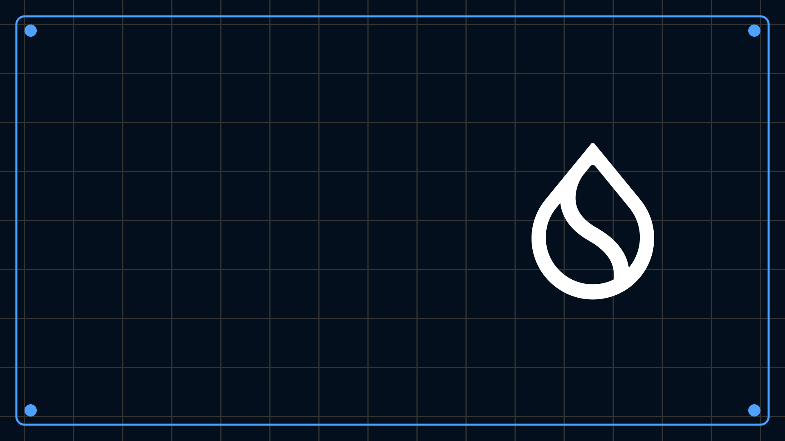

# 最初の<br>スマートコントラクトを作る

高度なMoveの概念、Sui固有機能、
フレームワーク連携、実践プロジェクト


---
# アジェンダ

 **モジュール初期化子init**
 **Suiフレームワーク & ライブラリ連携**
 **所有権モデル**（単独/共有/不変）
 **PTB**（Programmable Transaction Blocks）
 **テストと検証 & ガス最適化**
 **動的フィールド**
 **Sui Kioskについて**
 **Clock と時間**
 **ワークショップ**

---

# モジュール初期化子init

* **いつ動く？** パッケージ**公開時に1度だけ**自動実行される関数。
* **主な用途**: シングルトン権限(管理者Cap等)の初期発行、`Display`の登録、定数設定など。

* **実例**:
  * 管理者権限(admin cap)の発行
  * Publisher(このモジュールを発行した本人であることを証明する“権限オブジェクト”)の発行
  * Display（ウォレット/エクスプローラ向けの見た目メタデータ（名前・説明・画像URLなど）を、テンプレートとしてオンチェーン登録する仕組み）など

---

## init と Capability（例）

```move
module workshop::admin_cap {
    use sui::object::{Self, UID};
    use sui::tx_context::{Self, TxContext};
    use sui::transfer;

    public struct AdminCap has key, store { id: UID }

    fun init(ctx: &mut TxContext) {
        let cap = AdminCap { id: object::new(ctx) };
        transfer::public_transfer(cap, tx_context::sender(ctx));
    }
}
```

> 公開時に一度だけ権限オブジェクトを作成→デプロイヤに渡す。

---

## TxContext（トランザクション・コンテキスト）

- **なに？** 1回のトランザクション中だけ使える**実行メモ**  
- **できること**  
  - 送信者アドレスを見る（誰が実行したか）  
  - 新しいオブジェクトID（UID）を発行  
  - 実行の記録（イベント付与 など）の裏方  
- **できないこと**  
  - 保管・返却・永続化（その場限り）  
  - 時刻の取得（時間は **clock** を使う）  
- **ねらい** 副作用の見える化＋IDの一意性保証

---

## なんで“勝手に”引数にいるの？

- **理由**：関数の型に `&mut TxContext` を書くと、**Suiが自動注入**  
  - ユーザーが渡すのではなく、**VMが用意して渡す**特別な引数  
- **いつ入る？**  
  - **`init`** 実行時  
  - PTBから呼ぶ関数で**シグネチャに要求したとき**  
- **使い方の超基本**  
  - **必要な関数だけ**に付ける（なんでも付けない）  
  - 長期権限は**Cap（AdminCap等）**で管理  
  - 時刻が必要なら**clock**を使う  
- **一言まとめ**：**「チェーンを触る合図」＋「新しいIDの発行機」**


---
## use とモジュールのインポート（基礎）

- 目的：外部モジュールの**型・関数**を短く呼ぶ
- 書式：`use <パス>::{型, 関数};`（例示不要）
- 主なパス：`std::...`（言語標準） / `sui::...`（Sui固有）
- 使い分け：
  - **モジュール単位**で読み込む／**型だけ**取り込むを使い分け
  - 名前衝突しそうなら**フルパス**で呼ぶ
- 実務ルール：未使用のuseは削除／読みやすさを最優先

---
# フレームワーク & ライブラリ連携

* `sui::coin`（カスタムトークン / `TreasuryCap<T>`）
* `sui::pay`（支払いユーティリティ）
* `sui::event`（イベント発行）
* `sui::transfer` / `sui::object`（転送/生成）
* `std::string` / `std::vector`（基本構造）

```move
use sui::event;

public struct Minted has drop { name: vector<u8> }
public fun emit_minted(n: vector<u8>) { event::emit(Minted { name: n }) }
```

---

## 工具箱としてのフレームワーク

* `sui::coin` = お金の型・金庫の鍵（`TreasuryCap<T>`）
* `sui::pay` = 支払い・おつり計算
* `sui::event` = 連絡網（履歴を外に出す）
* `std::string` / `std::vector` = メモと箱

> まずは“何があるか”を知っておく。細かい使い方は都度辞書引き。

---

# 所有権モデル（Owned / Shared / Immutable）

* **Owned**: 単独所有。高速・並列向き。ユーザー固有NFTやポジションに最適。
* **Shared**: 複数が操作。**合意が必要**なためコスト高だが、マーケット/プール等の共用リソースに必須。
* **Immutable**: 生成後に不変。安全に**広く参照**される定数・ルール・テンプレの格納に向く。

> **選び方**: 「誰がいつ更新するか？」で決める。**個別更新=Owned / 共同更新=Shared / 参照専用=Immutable**。

リンク：[https://docs.sui.io/concepts/object-model](https://docs.sui.io/concepts/object-model)

---

## 所有権モデル（コード例）

```move
// コイン C を 0xB0B へ譲渡
transfer::public_transfer(C, @0xB0B);
```

> 所有者が変わると、操作できる主体も移ります。

---


## PTB（Programmable Transaction Block）とは？

- **定義**：1つのトランザクション内で複数の操作を**順序付きで束ねる「ミニ・プログラム」**
- **中身の例**：Move関数呼び出し／オブジェクト転送／コイン分割・統合／パッケージ公開 など
- **性質**：
  - **アトミック**：全部成功 or 全部取り消し（途中失敗でロールバック）
  - **データ受け渡し**：前ステップの結果を後続で参照できる
  - **スパンサー対応**：実行者とガス支払者を**分離**できる（Sponsored Tx）

---

## PTBのメリット

- **メリット**
  - **往復回数を削減**：複数操作を**一度に**実行
  - **安全**：アトミックで**不整合が残らない**
  - **合成力**：例）NFT**ミント→出品→記録**を一貫処理
  - **透明性**：どのオブジェクトを触るかが明示的で監査しやすい
---

## PTB
* 例：

  1. コインを割る（`SplitCoins`）
  2. 手数料を払う（`Pay`）
  3. NFT を渡す（`TransferObjects`）
* 1回のトランザクションで **複数の手順** を安全にまとめて実行できる。

---
# テストと検証 & ガス最適化（概観）

* **ユニットテスト**：`#[test]` 
* **形式検証（Move Prover）**：数学的に検証する手法（今回は割愛）
* **ガス最適化**：コピー削減、共有の抑制、ストレージ節約

---

## Moveのテストとは？

- **目的**：仕様どおりに動くかを**ローカルで高速検証**（チェーン外で安全に）
- **得られる安心**  
  - バグの早期発見（ミント条件/手数料/アクセス制御など）  
  - 仕様のドキュメント化（“こう振る舞う”をテスト名で示す）
- **実行**：`sui move test`（パッケージ内のテストを一括実行）
- **基本範囲**：成功パスだけでなく失敗パス（リバート）も必ず用意
- **ねらい**：本番前に**不整合や権限漏れ**を潰す

---

## どう書く？（最小ルールと設計コツ）

- **最小ルール**  
  - テスト関数に属性（例：`#[test]`）、失敗想定には（例：`#[expected_failure]`）  
  - テスト専用ヘルパは（例：`#[test_only]`）で本番バイナリから除外  
  - 1テスト＝**1つの振る舞い**に絞り、名前は**仕様を日本語で要約**
- **設計のコツ**  
  - **準備は最小限**（必要なオブジェクトだけ作る／共有オブジェクトは極力避ける）  
  - **成功＋失敗**を対で揃える（権限なし・境界値・二重実行など）  
  - **副作用の検証**：残高・所有者・フラグ・イベントなど**結果**を確認  
  - **時間条件**は `clock` を前提にロジックを分離（テストは時刻を差し替え可能に）  
  - 変更が多い箇所ほど**テスト先行**（ミント条件、手数料、出品/取消 など）
---

## 失敗例を先に潰す（チェックリスト）

- 権限Capなしで実行 → **失敗**を期待  
- 同じID/二重ミント → **失敗**を期待  
- 不正な価格/手数料（0や上限超え） → **失敗**を期待  
- 所有者以外の更新/転送 → **失敗**を期待  
- 上限超の動的フィールド追加 → **失敗**を期待

> 成功テストだけだと抜け漏れが増えます。**失敗の形**を先に列挙してテストに落とすのがコツ。

---

## ユニットテスト（最小例）

```move
module workshop::tests {
    use std::string::utf8;
    use sui::tx_context as tx;
    use workshop::nft;

    #[test]
    fun mint_works() {
        let mut ctx = tx::dummy();
        nft::mint(utf8(b"A"), utf8(b"B"), utf8(b"C"), &mut ctx);
        // アボートしなければ最小合格
    }
}
```

CLI：`sui move test`

---

## ガス最適化の指針

* `copy` 乱用を避ける（`copy` アビリティ付与は慎重に）
* **イベントで履歴**、恒久保存は最小限
* 巨大 `vector<T>` の再構築を避ける
* **共有オブジェクトは必要最小限**（合意コスト）

---

# 動的フィールド（概観）

* **Dynamic Field**：親 `UID` に任意値（`store`）をキー付き保存
* **Dynamic Object Field**：親 `UID` に **オブジェクト（`key`）** をキー付き保存

---

## 動的フィールド

* **あとから付け足せる引き出し**。
* **Dynamic Field**：メモ（任意の値）を貼るイメージ。例）ゲームキャラNFTの新たなワザの追加・レベルの変更など
* **Dynamic Object Field**：小さな箱（`key`オブジェクト）をぶら下げられる。(アバターNFTに服NFTを持たせられるなど)

> NFTに「称号」「レベル」などを後から足す時に便利。

---

## Dynamic Field / Dynamic Object Field の違い

| 種類                   | 値            | 参照性                     |
| -------------------- | ------------ | ----------------------- |
| Dynamic Field        | 任意の `store`  | 値がラップされ ID 直参照は不可       |
| Dynamic Object Field | `key` オブジェクト | **オブジェクトID** で外部から辿りやすい |

---

## Dynamic Field（例）

```move
module workshop::attrs {
    use std::string::String;
    use sui::dynamic_field as df;
    use workshop::nft::Nft;

    public fun put_attr(nft: &mut Nft, key: String, val: String) {
        df::add(&mut nft.id, key, val);
    }
}
```

---

## Dynamic Object Field（例）

```move
module workshop::child_link {
    use sui::dynamic_object_field as dof;
    use sui::object::{Self, UID};

    public struct Child has key, store { id: UID }

    public fun link(parent: &mut UID, child: Child) {
        let id = object::uid_to_inner(&child.id);
        dof::add(parent, id, child);
    }
}
```

---

## Suiにおけるマーケットプレイス

* SuiではKioskというマーケットプレイス用のフレームワークがあります。
* アセットを保存して販売リストを作成したり、オークションなどのカスタム取引機能を利用したりすることができます。

---

## Kiosk とは？（概要）

* **Sui ネイティブ**のオンチェーンコマース基盤（フレームワーク標準）。
* クリエイターは **取引ルール（ポリシー）** を定義でき、取引ごとに適用。
* **購入が完了する瞬間まで**、出品資産の“本当の所有者”は出品者のまま（安全）。
* マーケットは Kiosk の**イベントを購読**して一覧・検索を提供できる。

---

## Kiosk の主要パーツ

* **Kiosk**：資産を置く場所（多くの操作を第三者が安全に扱えるよう設計）
* **KioskOwnerCap**：Kiosk に対する**所有者権限の証明**（オーナーだけが特権操作）
* **Item / Listing**：置いた資産と販売情報
* **PurchaseCap**：専用購入権（特定の購入者に“専用枠”を与える上級機能）
* **TransferPolicy**：クリエイターが定義する**取引ルール**（例：ロイヤリティ支払い、制限付き転送）

> Cap（権限）と Policy（ルール）の二本柱で「安全な売買」と「作者の意図」を両立します。

---

## アイテムの状態（ざっくり）

* **placed**：Kiosk に置いた状態。オーナーは取り出し可能。
* **locked**：取り出し不可。**売買を経ないと**外に出せない（強い拘束）。
* **listed**：価格を付けて出品中。他人が購入でき、編集は不可。
* **listed_exclusively**：特定の **PurchaseCap** と組み合わせた専用出品（高度）。

> `locked` は **TransferPolicy が存在**する前提で使うのが安全（取り出せず“閉じ込め”ないように）。

---

## TransferPolicy（何ができる？）

* 取引ごとに **TransferRequest** が作られ、Policy 側で検証・処理。
* 代表例：

  * **Royalty Rule**：再販売時に作者へロイヤリティ送付
  * **Lock Rule**：Kiosk 以外への不正な転送を**禁止**
  * 会員特典：特定オブジェクト保有者は手数料免除 など
* ルールの変更は**即時・全体**に反映できる設計（設計例）。

> クリエイターは「どう転送されたら困るか」をルール化し、マーケットはそれを尊重して売買を成立させます。


---

##  参考リンク

* Kiosk（標準ドキュメント）: [https://docs.sui.io/standards/kiosk](https://docs.sui.io/standards/kiosk)
* Kiosk Apps: [https://docs.sui.io/standards/kiosk-apps](https://docs.sui.io/standards/kiosk-apps)
* フレームワーク `sui::kiosk` 参照: [https://docs.sui.io/references/framework/sui_sui/kiosk](https://docs.sui.io/references/framework/sui_sui/kiosk)
* フレームワーク `sui::transfer_policy` 参照: [https://docs.sui.io/references/framework/sui_sui/transfer_policy](https://docs.sui.io/references/framework/sui_sui/transfer_policy)
* Kiosk SDK（TypeScript）: [https://sdk.mystenlabs.com/kiosk](https://sdk.mystenlabs.com/kiosk)

---

# Clockと時間

* `Clock` はネットワークに 1 つの共有オブジェクト
* `clock::timestamp_ms(&Clock)` で現在時刻（ミリ秒）
* **Clock**：みんなが信用する **公式時計**。ズルできない。
* 例：一定時間後にだけミント可能など。

---

## Clock（例）

```move
use sui::clock::{Self, Clock};

public entry fun mint_after(deadline_ms: u64, clock: &Clock /*, ... */) {
    let now = clock::timestamp_ms(clock);
    assert!(now >= deadline_ms, 1);
    // 期限を過ぎていれば続行
}
```


---

# ここからはワークショップ

この先は**手を動かす時間**です。スライドのコードはコピペOK。まずは動かすことを最優先に進めます。

---

# ワークショップ（ハンズオン開始）

* 目標：最小の **NFT** を作って動かす
* 方式：講師の投影に合わせて **写経（code-along）**
* ゴール：`publish` → `call` で **動作確認ができる**

> 「完璧な設計」よりも「動く体験」をしてみよう！

---

##  進め方

1. `sui move new nft_workshop` で新しいパッケージを作成
2. NFTのコードを作成
3. `sui move publish` → `call` で動作確認
4. 分からない所はその場で質問OK（手が止まったら合図）

---

##  教材リポジトリ

* リポジトリ：`SuiJapan/nft-mint-sample`

  * URL: [https://github.com/SuiJapan/nft-mint-sample](https://github.com/SuiJapan/nft-mint-sample)
  * **`contracts/`** に Move の見本コード
* VS Code で開き、（必要なら）Devコンテナで実行
* この章では、`contracts/` を **見本** にしながら自分のパッケージに写経します

---

## 新しいパッケージを作る

**どこで実行する？** → リポジトリの**ルート**（`contracts/` と同じ階層）がおすすめ。

```bash
# リポジトリのルートで（例: nft-mint-sample/ の直下）
sui move new nft_workshop
```

* すると `./nft_workshop/` が作られます（`Move.toml` と `sources/` を含む）
* 自分で `sources/nft.move` を作ります

---

## Move.toml の設定（名前付きアドレス）

`nft_workshop/Move.toml` に **`nft`**** アドレス** を追加します。

```toml
[package]
name = "nft_workshop"
version = "0.0.1"

[addresses]
# 見本コードは `module nft::nft;` なので、`nft` を定義
nft = "0x0"
```

> 以降、モジュールは `module nft::nft { ... }` と書けます。

---

##  ファイル作成：`sources/nft.move`

1. リポジトリで `contracts/nft.move` を開く
2. nftのコントラクトを見本を見ながら作成してみよう

---
## 重要ポイント（コード解説）

* **`module nft::nft`**：`Move.toml` の `[addresses] nft = "0x0"` とペア（名前付きアドレス）。
* **`WorkshopNFT has key, store`**：オンチェーン第一級オブジェクト。最初のフィールドは **`id: UID`**** 必須**。
* **`init`**** + ****`package::claim`**：Publish時だけ使える**ワンタイム証明**で `display` を初期化、`update_version()` で有効化。
* **`mint`**** → ****`mint_internal`**：エントリは入口、ロジックは内部関数へ分離（再利用しやすくテストもしやすい）。
* **`assert!`**** による最小バリデーション**：空文字など明らかな不正を早期に弾く。
---

## Publish & Call（動かす）

```bash
# nft_workshop ディレクトリで
cd nft_workshop

# ビルド
sui move build

# （必要なら）ネットワークを testnet に
sui client switch --env testnet

# 公開（PACKAGE_ID をメモ）
sui client publish --gas-budget 100000000

```

---

```bash
# ミント（単発）
sui client call \
  --package <PACKAGE_ID> \
  --module nft \
  --function mint \
  --args "SuiJapan NFT" "Hello" "https://example.com/image.png" \
  --gas-budget 100000000

# ミント（複数）例
sui client call \
  --package <PACKAGE_ID> \
  --module nft \
  --function mint_bulk \
  --args 2 \
  '["A","B"]' '["descA","descB"]' '["https://ex/a.png","https://ex/b.png"]' \
  --gas-budget 100000000
```


